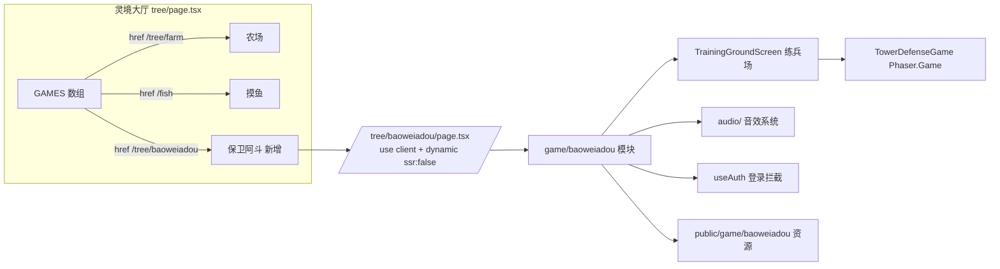

## 产品概述

将本机 `E:\data\jijiandzzd`（Vite + React + Phaser 3 游戏门户）中的「保卫阿斗」塔防游戏完整迁移合并到 `E:\data\blog-test`（Next.js）的「灵境」中。在灵境大厅开放一个与「摸鱼房间」「灵境农场」并列的「保卫阿斗」游戏入口，并同步完善现有农场与摸鱼模块的前后端数据同步问题。

## 核心功能

- 在项目文件中单开 `game` 目录，game 下按单个游戏分子目录存放，如 `game/baoweiadou`。
- 「保卫阿斗」完整迁移，包含：塔防战斗（棋盘布阵、武将合成、资源经营、波次防守、吕布等 BOSS 战）、开始界面（模式/头像/武器/排行榜）、开发者控制台、练兵场（training，9 名武将、台词、菜单、像素小人动画）、独立音效系统、武将/武器/BOSS 单位系统。
- 进入流程：点击灵境大厅「保卫阿斗」卡片 → 先进练兵场（军营）→ 从练兵场点「开始」进战斗，保留原项目完整流程。
- 灵境大厅（tree 页面）GAMES 数组新增「保卫阿斗」卡片，与「灵境农场」「摸鱼房间」并列，路由 `/tree/baoweiadou`。
- 修复农场后端 `userId` 恒为 undefined 的数据不同步 bug，并复核完善农场/摸鱼前后端数据同步。

## 边界与约束

- 完整保留阿斗游戏原有功能与静态资源（特效图、音效、练兵场背景/立绘、头像、封面）。
- 不改变现有摸鱼（fish）和农场（farm）的既有功能与路由（仅修复/完善同步逻辑）。
- 阿斗游戏本身不加后端持久化（纯本地游戏）；仅加前端页面、代码、资源与入口。
- 需为前端新增 `phaser`（游戏引擎）与 `zustand`（练兵场 store）依赖。

## 技术栈

- 目标框架：Next.js 16.2.6 App Router（frontend/src/app），React 19.2.4，TypeScript
- 游戏引擎：Phaser 3（新增依赖，用 `dynamic(..., { ssr: false })` 加载避免 SSR 报错）
- 状态管理：zustand（新增，练兵场 store 原样迁移）
- 样式：Tailwind v4（globals.css）+ 迁移的阿斗独立样式（作用域隔离）
- 鉴权：复用现有 `@/contexts/AuthContext` 的 `useAuth()`（替换原 `useAppStore` 的用户信息）
- 后端：Express + sql.js，`requireAuth` 挂载 `req.user = { id, username, role }`

## 实现思路

将阿斗游戏从 Vite SPA 迁移到 Next.js App Router，核心是「解耦 + 路径改写 + 资源搬运」：

1. 阿斗代码整体复制到 `frontend/src/game/baoweiadou/`，使游戏模块自包含，并迁移音效系统（audio/）。
2. 解耦外部依赖：用户信息改用 blog-test 的 `useAuth()`；hash 路由/`sessionStorage` 返回逻辑改为 Next.js 路由跳转（保留 localStorage 头像/devConfig/audio 设置）。
3. 静态资源复制到 `frontend/public/game/baoweiadou/`，统一改写所有资源引用路径。
4. 阿斗样式从源 `styles.css` 提取迁移，作用域隔离避免与 Tailwind 冲突。
5. 新建 `/tree/baoweiadou` 页面作为游戏挂载点，注册到灵境大厅 GAMES 数组。
6. 修复农场 `gameController.ts` 的 `userId` bug（`req.user.userId` → `req.user.id`），并复核农场/摸鱼前后端同步，完善不完美之处。

## 架构设计

采用「页面路由层 + 自包含游戏模块层」结构，游戏模块内部沿用原架构（Phaser 场景 + React UI 覆盖层 + 独立武器/单位/练兵场子系统），与 blog-test 的博客、摸鱼、农场解耦。



## 目录结构

```
frontend/
├── src/
│   ├── app/tree/
│   │   ├── page.tsx                         # [MODIFY] GAMES 数组新增"保卫阿斗"入口
│   │   └── baoweiadou/
│   │       └── page.tsx                     # [NEW] 游戏页面路由，dynamic 加载 Phaser，useAuth 拦截
│   ├── game/baoweiadou/                     # [NEW] 阿斗游戏核心代码（自包含）
│   │   ├── index.ts                         # 统一导出（解耦后）
│   │   ├── config.ts / devConfig.ts / Unit.ts
│   │   ├── GamePlayScene.ts / FxTestScene.ts
│   │   ├── components/                      # TowerDefenseGame / GameStartScreen / DevConsole
│   │   ├── units/                           # Soldier/Farm/General/GeneralFragment/Zombie/LuBu/DiaoChan/CaoCao/WeiUnit
│   │   ├── weapons/                         # types/registry/series/damage/mount/index
│   │   ├── effects/playSlashDownSwing.ts
│   │   ├── audio/                           # [NEW] audioSystem/audioConfig/AudioToggleButton（改路径）
│   │   └── training/                        # 练兵场（index/layout/store/types/components/hooks）
│   └── ...（其余模块不动）
└── public/
    └── game/baoweiadou/                     # [NEW] 静态资源
        ├── effects/                         # slash 等特效图
        ├── audio/sfx/                       # 全部音效 ogg/wav
        ├── training-ground/                 # 背景 + 武将立绘 + prompt.txt
        ├── avatars/                         # avatar-01~04
        └── cover-adou.png                   # 游戏封面
```

## 实现要点

- **依赖安装**：`cd frontend && npm install phaser zustand`。
- **Phaser SSR**：页面用 `dynamic(() => import('@/game/baoweiadou'), { ssr: false })`；若构建报 canvas/global 错误，再在 next.config.ts 补 webpack fallback。
- **资源路径统一改写**：
- `effects/*.png` → `/game/baoweiadou/effects/*.png`（GamePlayScene preload）
- `/assets/audio/sfx/*` → `/game/baoweiadou/audio/sfx/*`（audioConfig）
- `/assets/training-ground/*` → `/game/baoweiadou/training-ground/*`（Stage.tsx）
- `/avatars/*` → `/game/baoweiadou/avatars/*`（GameStartScreen）
- **鉴权解耦**：GameStartScreen 的 `useAppStore(state=>state.user)` 替换为 `useAuth()`，显示 `user.username`。
- **路由解耦**：TowerDefenseGame 的 onBack 改为 Next 路由；练兵场启动战斗用 router 跳转代替 hash 跳转；移除 `mini-playbox-return-to` 的 sessionStorage 返回逻辑（改为路由栈导航）。
- **农场 bug 修复**：`backend/src/controllers/gameController.ts` 中 `(req as any).user.userId` → `(req as any).user.id`（共 2 处，getFarmState/updateFarmState）。
- **农场/摸鱼同步完善**：修复后验证农场存档真实恢复；复核摸鱼房间/消息/参与者的轮询与清理逻辑，补充缺失的鉴权或字段同步。
- **样式隔离**：从源 `styles.css` 提取 tower-defense-*/game-start-*/crt-overlay/weapon-*/avatar-picker-*/tg-* 类，放入 baoweiadou 页面的独立 `<style>` 或 CSS 文件，避免污染全局。
- **兼容性**：阿斗模块与摸鱼/农场解耦；仅改 tree/page.tsx（增入口）和 gameController.ts（修 bug），不动 fish/ 与 tree/farm/ 主体逻辑。

## 关键代码结构（页面挂载示意）

```
// frontend/src/app/tree/baoweiadou/page.tsx
"use client";
import dynamic from "next/dynamic";
const AdouGame = dynamic(() => import("@/game/baoweiadou"), { ssr: false });
// 用 useAuth() 拦截未登录 → 显示提示 + 跳 /login
// 默认渲染练兵场入口，启动战斗后切换渲染 <TowerDefenseGame onBack=.../>
```

## Agent 扩展

### SubAgent

- **code-explorer**
- 用途：在执行过程中复核源/目标项目中阿斗代码的 import 依赖、资源引用路径、tree 大厅 GAMES 数组结构，以及农场/摸鱼前后端字段与鉴权的一致性，确保解耦、路径改写与同步修复完整无遗漏。
- 预期结果：确认所有外部耦合点被正确解耦、所有资源路径被统一改写、入口注册准确、农场 userId bug 与摸鱼同步问题被准确定位并修复。